# Vector Databases Masterclass: Systems Engineering & High-Dimensional Search

[](https://en.wikipedia.org/wiki/Nearest_neighbor_search)
[](https://en.wikipedia.org/wiki/Vector_quantization)
[](https://qdrant.tech/)
[](https://github.com/erikbern/ann-benchmarks)
[](LICENSE)

Welcome to the **Staff-Level Masterclass on Vector Databases**. This curriculum delivers an exhaustive, production-grade guide to designing, indexing, optimizing, and operating high-dimensional vector search engines at massive scale. From Euclidean geometry and the mathematical mechanics of HNSW graphs and Product Quantization (PQ) to PostgreSQL `pgvector`, Qdrant, Pinecone, payload-filtered single-stage graphs, and multi-tenant sharding architectures, this guide provides complete systems engineering knowledge.

---

## Pedagogical Roadmap: 7-Stage Curriculum

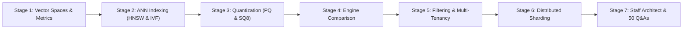

---

## Master Table of Contents

- [Stage 1: Absolute Beginner Foundations & Vector Geometry](#stage-1-absolute-beginner-foundations--vector-geometry)
  - [1.1 What is a Vector Database and Why Do They Exist?](#11-what-is-a-vector-database-and-why-do-they-exist)
  - [1.2 Mathematical Foundations: High-Dimensional Vectors in $\mathbb{R}^D$](#12-mathematical-foundations-high-dimensional-vectors-in-mathbbrd)
  - [1.3 The Curse of Dimensionality & Failure of B-Trees / R-Trees](#13-the-curse-of-dimensionality--failure-of-b-trees--r-trees)
  - [1.4 Vector Distance Metrics: Euclidean, Manhattan, Dot Product, Cosine, Hamming](#14-vector-distance-metrics-euclidean-manhattan-dot-product-cosine-hamming)
  - [1.5 Metric Invariance & The Crucial Importance of $L_2$ Normalization](#15-metric-invariance--the-crucial-importance-of-l_2-normalization)
  - [1.6 Dense Vectors vs Sparse Vectors vs Hybrid Representations](#16-dense-vectors-vs-sparse-vectors-vs-hybrid-representations)
- [Stage 2: Approximate Nearest Neighbor (ANN) Indexing Algorithms](#stage-2-approximate-nearest-neighbor-ann-indexing-algorithms)
  - [2.1 Exact kNN Brute-Force vs Approximate Nearest Neighbor (ANN)](#21-exact-knn-brute-force-vs-approximate-nearest-neighbor-ann)
  - [2.2 Inverted File (IVF) Indexes & Voronoi Cell Partitioning](#22-inverted-file-ivf-indexes--voronoi-cell-partitioning)
  - [2.3 Hierarchical Navigable Small World (HNSW) Graphs Deep Dive](#23-hierarchical-navigable-small-world-hnsw-graphs-deep-dive)
  - [2.4 HNSW Graph Hyperparameters: $M$, $efConstruction$, and $efSearch$](#24-hnsw-graph-hyperparameters-m-efconstruction-and-efsearch)
  - [2.5 Tree-Based Indexes (Annoy) & Locality-Sensitive Hashing (LSH)](#25-tree-based-indexes-annoy--locality-sensitive-hashing-lsh)
- [Stage 3: Quantization & Memory Compression Techniques](#stage-3-quantization--memory-compression-techniques)
  - [3.1 The Memory Crisis: Calculating High-Dimensional Vector RAM Sizing](#31-the-memory-crisis-calculating-high-dimensional-vector-ram-sizing)
  - [3.2 Scalar Quantization (SQ8): Scaling FP32 to INT8](#32-scalar-quantization-sq8-scaling-fp32-to-int8)
  - [3.3 Product Quantization (PQ): Sub-Vector Codebooks & Lookup Tables](#33-product-quantization-pq-sub-vector-codebooks--lookup-tables)
  - [3.4 Asymmetric Distance Computation (ADC) vs Symmetric Distance Computation (SDC)](#34-asymmetric-distance-computation-adc-vs-symmetric-distance-computation-sdc)
  - [3.5 1-bit Binary Quantization (BQ) & Hardware XOR / POPCNT Acceleration](#35-1-bit-binary-quantization-bq--hardware-xor--popcnt-acceleration)
- [Stage 4: Database Landscape & Architectural Comparison](#stage-4-database-landscape--architectural-comparison)
  - [4.1 Dedicated Specialized Vector DBs vs Vector-Extended Databases](#41-dedicated-specialized-vector-dbs-vs-vector-extended-databases)
  - [4.2 Architectural Breakdown: Qdrant, Pinecone, Milvus, Weaviate, ChromaDB](#42-architectural-breakdown-qdrant-pinecone-milvus-weaviate-chromadb)
  - [4.3 Relational & Document Extensions: PostgreSQL `pgvector`, Redis VSS, OpenSearch](#43-relational--document-extensions-postgresql-pgvector-redis-vss-opensearch)
  - [4.4 Storage Engine Layouts: In-Memory vs MMAP Disk-Backed vs TurboQuant SSD](#44-storage-engine-layouts-in-memory-vs-mmap-disk-backed-vs-turboquant-ssd)
- [Stage 5: Metadata Filtering, Multi-Tenancy & Hybrid Search](#stage-5-metadata-filtering-multi-tenancy--hybrid-search)
  - [5.1 The Filtering Dilemma: Post-Filtering vs Pre-Filtering Recall Collapse](#51-the-filtering-dilemma-post-filtering-vs-pre-filtering-recall-collapse)
  - [5.2 Single-Stage Payload-Filtered HNSW Graph Traversal](#52-single-stage-payload-filtered-hnsw-graph-traversal)
  - [5.3 Multi-Tenancy Isolation Patterns: Namespaces vs Collections vs Partition Keys](#53-multi-tenancy-isolation-patterns-namespaces-vs-collections-vs-partition-keys)
  - [5.4 Hybrid Search: Fusing Vector Proximity with Inverted Text Indexes](#54-hybrid-search-fusing-vector-proximity-with-inverted-text-indexes)
- [Stage 6: Distributed Scaling, Sharding & Production Operations](#stage-6-distributed-scaling-sharding--production-operations)
  - [6.1 Distributed Topologies: Coordinators, Shard Replicas & Raft Consensus](#61-distributed-topologies-coordinators-shard-replicas--raft-consensus)
  - [6.2 High-Throughput Write Pipelines: WAL, Segment Immutability & Compaction](#62-high-throughput-write-pipelines-wal-segment-immutability--compaction)
  - [6.3 Hardware Acceleration: SIMD, AVX-512, and ARM Neon Vectorization](#63-hardware-acceleration-simd-avx-512-and-arm-neon-vectorization)
  - [6.4 Snapshot Backups, Recovery & Zero-Downtime Index Rebuilding](#64-snapshot-backups-recovery--zero-downtime-index-rebuilding)
- [Stage 7: Staff Vector Architect: Enterprise Blueprint, Benchmarks & 50 Interview Q&As](#stage-7-staff-vector-architect-enterprise-blueprint-benchmarks--50-interview-qas)
  - [7.1 Production Enterprise Blueprint: Qdrant Multi-Tenant Microservice with Filtering](#71-production-enterprise-blueprint-qdrant-multi-tenant-microservice-with-filtering)
  - [7.2 The ANN-Benchmarks Methodology: Recall@K vs QPS vs Build Latency](#72-the-ann-benchmarks-methodology-recallk-vs-qps-vs-build-latency)
  - [7.3 50 Staff-Level Vector Database Technical Interview Questions & Answers](#73-50-staff-level-vector-database-technical-interview-questions--answers)
  - [7.4 Master Vector Database Comparison & Sizing Cheat Sheet](#74-master-vector-database-comparison--sizing-cheat-sheet)

---

## Stage 1: Absolute Beginner Foundations & Vector Geometry

### 1.1 What is a Vector Database and Why Do They Exist?

Relational databases (PostgreSQL, MySQL) and NoSQL stores (MongoDB, Cassandra) are built to query **structured scalar data** using exact equality (`WHERE id = 101`) or scalar range comparisons (`WHERE age >= 21 AND age <= 65`).

However, unstructured human data—natural language documents, code repositories, audio recordings, images, and video frames—cannot be indexed by scalar equality. An image of a golden retriever does not match another golden retriever by byte-for-byte string equality.

A **Vector Database** is a database purpose-built to store, index, and query **high-dimensional mathematical vectors** produced by Deep Neural Networks (Embedding Models). Instead of exact matching, vector databases perform **Similarity Search**: finding the nearest data points in continuous geometric space.

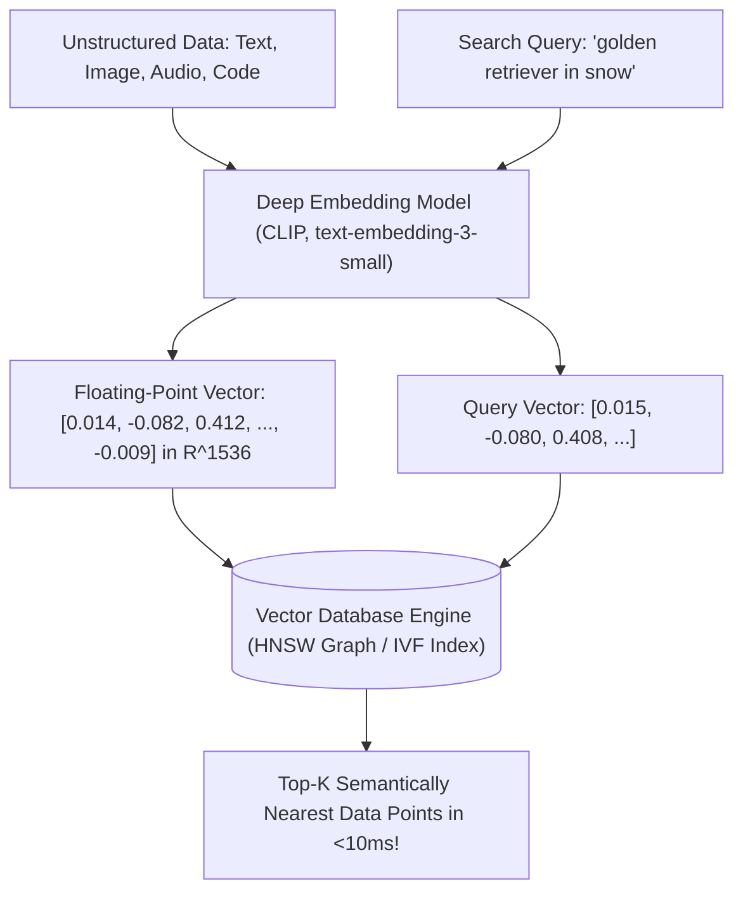

---

### 1.2 Mathematical Foundations: High-Dimensional Vectors in $\mathbb{R}^D$

A vector $\mathbf{v} \in \mathbb{R}^D$ is an ordered tuple of $D$ real numbers representing coordinates in a $D$-dimensional metric space:

$$\mathbf{v} = \begin{bmatrix} v_1 \\ v_2 \\ \vdots \\ v_D \end{bmatrix} \in \mathbb{R}^D$$

- In text embeddings, $D$ typically equals **384** (`all-MiniLM-L6-v2`), **768** (`bge-base`), **1536** (`text-embedding-3-small`), or **3072** (`text-embedding-3-large`).
- In image/multimodal embeddings, $D$ typically equals **512** or **768** (`OpenAI CLIP`).
- Each dimension represents an abstract, latent semantic feature discovered by the neural network during self-supervised contrastive pretraining.

---

### 1.3 The Curse of Dimensionality & Failure of B-Trees / R-Trees

Software engineers often ask: *"Why can't we index vector coordinates using standard database indexes like B-Trees, k-d Trees, or R-Trees?"*

#### The Geometric Collapse of High Dimensions
In low-dimensional spaces ($D = 2$ or $D = 3$), spatial partition trees (like k-d trees or quad-trees) divide space into bounding boxes, achieving $O(\log N)$ nearest-neighbor search.

However, as dimensionality $D$ grows ($D > 10$), high-dimensional geometry behaves counter-intuitively—a phenomenon known as the **Curse of Dimensionality**:

1. **Volume Concentration in the Shell**: The volume of a $D$-dimensional hypersphere of radius $R$ is concentrated almost entirely in a razor-thin shell at its outer boundary.
2. **Equidistance of All Points**: As $D \rightarrow \infty$, the distance between the nearest neighbor and the furthest neighbor approaches zero relative to the mean distance:
   $$\lim_{D \rightarrow \infty} \frac{\text{dist}_{\max} - \text{dist}_{\min}}{\text{dist}_{\min}} \rightarrow 0$$
   Every point in the database becomes roughly equidistant from every other point!
3. **B-Tree & Spatial Tree Collapse**: In high dimensions, every bounding box overlaps with almost every other bounding box. A query traversing a k-d tree or R-Tree must explore nearly **100% of all branches**, degrading tree search to an $O(N)$ brute-force linear scan while incurring massive tree pointer overhead!

Vector databases abandon spatial partition trees entirely in favor of **graph networks (HNSW)**, **inverted cluster lists (IVF)**, and **vector quantization (PQ)**.

---

### 1.4 Vector Distance Metrics: Euclidean, Manhattan, Dot Product, Cosine, Hamming

Vector databases compute similarity using geometric distance functions:

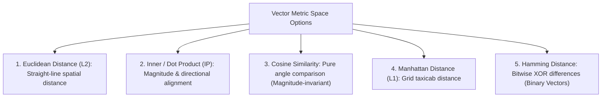

#### Detailed Mathematical Definitions

| Distance Metric | Formula | Value Range | Properties & Primary Use Cases |
| :--- | :--- | :--- | :--- |
| **Euclidean ($L_2$)** | $d(\mathbf{u}, \mathbf{v}) = \sqrt{\sum_{i=1}^D (u_i - v_i)^2}$ | $[0, \infty)$ | Straight-line distance. Lower is closer. Sensitive to vector magnitude. Computer vision, clustering. |
| **Squared Euclidean** | $d^2(\mathbf{u}, \mathbf{v}) = \sum_{i=1}^D (u_i - v_i)^2$ | $[0, \infty)$ | Omits the expensive square root operation ($\sqrt{}$). Monotonically identical rank order to $L_2$; used for faster indexing. |
| **Inner / Dot Product (IP)** | $\mathbf{u} \cdot \mathbf{v} = \sum_{i=1}^D u_i v_i$ | $(-\infty, \infty)$ | Higher is closer. Combines angle and vector length. Used in recommendation systems (matrix factorization). |
| **Cosine Distance** | $d_{\text{cos}}(\mathbf{u}, \mathbf{v}) = 1 - \frac{\mathbf{u} \cdot \mathbf{v}}{\|\mathbf{u}\|_2 \|\mathbf{v}\|_2}$ | $[0, 2.0]$ | Evaluates pure angular difference. Scale-invariant. Standard for natural language text embeddings. |
| **Manhattan ($L_1$)** | $d(\mathbf{u}, \mathbf{v}) = \sum_{i=1}^D \|u_i - v_i\|$ | $[0, \infty)$ | Taxicab sum of absolute coordinate differences. Less sensitive to extreme outliers than $L_2$. |
| **Hamming Distance** | $d_H(\mathbf{u}, \mathbf{v}) = \sum_{i=1}^D (u_i \oplus v_i)$ | $[0, D]$ | Counts differing bits in binary quantized vectors. Computable via CPU hardware `POPCNT(u ^ v)` in 1 CPU cycle! |

---

### 1.5 Metric Invariance & The Crucial Importance of $L_2$ Normalization

A vector $\mathbf{v}$ is **unit normalized ($L_2$-normalized)** if its Euclidean norm equals $1.0$:

$$\|\mathbf{v}\|_2 = \sqrt{\sum_{i=1}^D v_i^2} = 1.0 \implies \mathbf{v}_{\text{norm}} = \frac{\mathbf{v}}{\|\mathbf{v}\|_2}$$

#### The Mathematical Equivalence Theorem
When both vectors $\mathbf{u}$ and $\mathbf{v}$ are unit $L_2$-normalized ($\|\mathbf{u}\| = 1$ and $\|\mathbf{v}\| = 1$):

$$d_{L_2}^2(\mathbf{u}, \mathbf{v}) = \|\mathbf{u} - \mathbf{v}\|^2 = \|\mathbf{u}\|^2 + \|\mathbf{v}\|^2 - 2(\mathbf{u} \cdot \mathbf{v}) = 1 + 1 - 2(\mathbf{u} \cdot \mathbf{v}) = \mathbf{2 - 2(\mathbf{u} \cdot \mathbf{v})}$$

And since Cosine Distance is $1 - (\mathbf{u} \cdot \mathbf{v})$:

$$d_{L_2}^2(\mathbf{u}, \mathbf{v}) = 2 \cdot d_{\text{cos}}(\mathbf{u}, \mathbf{v})$$

#### Systems Engineering Significance:
1. **Cosine similarity and Dot product become mathematically identical** on normalized vectors!
2. Computing Cosine Distance naively requires computing two norms ($\sqrt{}$) and a division for every candidate vector during search.
3. If you pre-normalize all vectors at ingestion time, you can configure your vector database to use **Dot Product (Inner Product)** instead of Cosine Distance.
4. **Dot Product is $3\times$ to $5\times$ faster to compute** via SIMD instructions (FMA - Fused Multiply-Add) than full Cosine Distance!

---

### 1.6 Dense Vectors vs Sparse Vectors vs Hybrid Representations

Modern vector engines distinguish between two complementary mathematical vector formats:

| Property | Dense Vectors (e.g. OpenAI, BGE) | Sparse Vectors (e.g. BM25, SPLADE) |
| :--- | :--- | :--- |
| **Dimensionality** | Fixed low-to-medium: $D \in [256, 3072]$ | Massive vocabulary-sized: $D \in [30,000, 100,000+]$ |
| **Zero Values** | Virtually zero. 100% of dimensions have non-zero floats. | **99.9% Zeroes**. Typically only 50–200 non-zero weights. |
| **Semantic Representation**| Deep, abstract conceptual associations and synonyms. | Exact lexical tokens, IDs, acronyms, and specific terms. |
| **Storage Structure** | Contiguous floating-point memory arrays. | Inverted lists (posting lists: `term_id -> [(doc_id, weight)]`). |
| **Indexing Algorithm** | HNSW Graph, IVF Clusters, Product Quantization. | Inverted Indexes (Lucene, WAND - Weak AND). |

---

## Stage 2: Approximate Nearest Neighbor (ANN) Indexing Algorithms

### 2.1 Exact kNN Brute-Force vs Approximate Nearest Neighbor (ANN)

In high-dimensional vector search, there is a fundamental trade-off between **Recall (Accuracy)** and **Query Latency (Throughput)**:

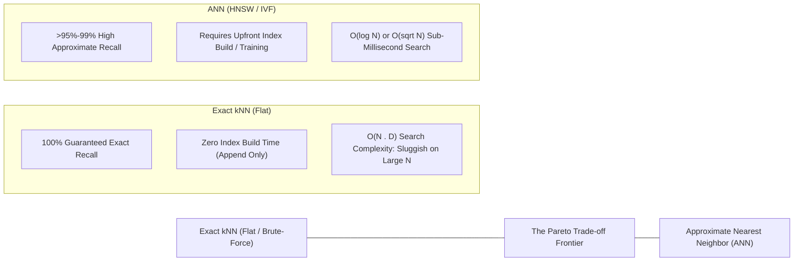

#### When to Use Exact kNN (Flat Index):
- Dataset size is small ($N < 50,000$ vectors). At 50K vectors, a brute-force SIMD scan completes in $<15\text{ms}$.
- Zero tolerance for recall error (e.g. biometric facial authentication, criminal fingerprint databases, fraud forensics).
- Ultra-high write throughput where background index construction cannot keep pace with streaming inserts.

For everything else ($N > 100,000$ to billions of vectors), **ANN indexing** is mandatory.

---

### 2.2 Inverted File (IVF) Indexes & Voronoi Cell Partitioning

The **Inverted File (IVF)** index partitions continuous high-dimensional vector space into discrete clusters using **k-means clustering**.

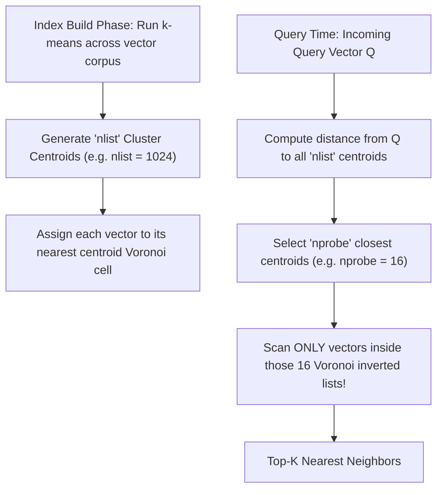

#### Key IVF Hyperparameters
1. **`nlist` (Number of Centroids)**: Determines cluster granularity. Common rule of thumb: $\text{nlist} \approx 4 \cdot \sqrt{N}$ to $16 \cdot \sqrt{N}$.
2. **`nprobe` (Number of Centroids Probed at Query Time)**:
   - Setting $\text{nprobe} = 1$: Fast query speed, but vectors situated near the boundary between two Voronoi cells are missed (lower recall).
   - Setting $\text{nprobe} = \text{nlist}$: Degrades to exact brute-force search ($100\%$ recall, slowest speed).
   - Standard production sweet spot: $\text{nprobe} \in [8, 64]$.

---

### 2.3 Hierarchical Navigable Small World (HNSW) Graphs Deep Dive

The **Hierarchical Navigable Small World (HNSW)** graph (*Malkov & Yashunin, 2016*) is universally recognized as the state-of-the-art algorithm for in-memory vector search, consistently dominating `ann-benchmarks.com`.

HNSW combines the logarithmic search efficiency of **Skip-Lists** with the clustering properties of **Navigable Small World (NSW) graphs**:

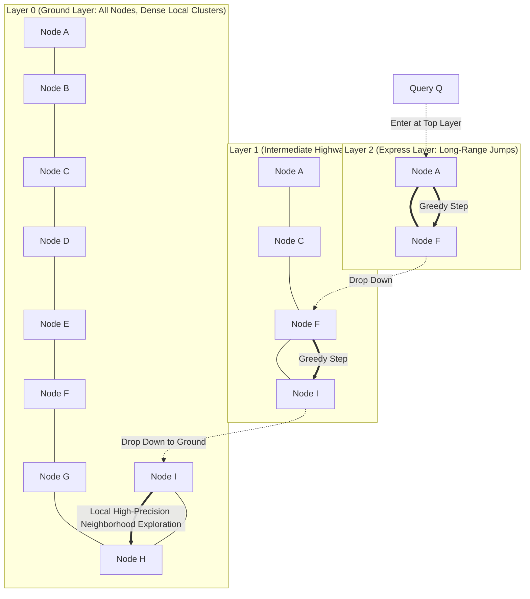

#### How HNSW Traversal Works:
1. **Multi-Layer Topology**: A hierarchy of graphs where the top layer contains very few nodes with long-range edges (expressway). Lower layers contain progressively more nodes with shorter, denser local edges. Layer 0 contains **all** indexed vectors.
2. **Greedy Routing**: Search begins at an entry point in the highest layer. The algorithm evaluates neighbors and hops to the node closest to the query vector until reaching a local minimum in that layer.
3. **Layer Drop-Down**: The local minimum becomes the entry point for the layer immediately below.
4. **Ground Layer Exploration**: Once search reaches Layer 0, the algorithm switches from simple greedy hopping to maintaining a dynamic priority queue of size $efSearch$, exploring the local dense neighborhood to collect the true Top-$K$ nearest neighbors.

---

### 2.4 HNSW Graph Hyperparameters: $M$, $efConstruction$, and $efSearch$

Tuning an HNSW index requires understanding its three governing hyperparameters:

| Hyperparameter | Scope | Default | Tuning Guide & Trade-offs |
| :--- | :--- | :---: | :--- |
| **$M$** | Index Build | $16$ | **Maximum number of bi-directional links (edges) per node**. Higher $M$ (e.g. $32$ or $64$) improves recall on complex high-dimensional datasets, but linearly increases graph RAM consumption and build times. ($M_0 = 2M$ on Layer 0). |
| **$efConstruction$** | Index Build | $64$–$128$ | **Size of dynamic candidate queue during graph construction**. Higher $efConstruction$ (e.g. $200$–$400$) yields a more connected, optimal graph with higher eventual search recall, at the cost of slower indexing speed. |
| **$efSearch$** | Query Time | $40$–$100$ | **Size of dynamic candidate queue during query search**. Crucial: $efSearch \ge K$. **Can be tuned dynamically per query!** Increasing $efSearch$ boosts recall at the expense of lower Queries Per Second (QPS). |

```text
Trade-off Curve:
efSearch = 20  --> 1,800 QPS, 92.1% Recall@10
efSearch = 64  -->   950 QPS, 97.8% Recall@10
efSearch = 200 -->   320 QPS, 99.4% Recall@10
```

---

### 2.5 Tree-Based Indexes (Annoy) & Locality-Sensitive Hashing (LSH)

#### 1. Annoy (Approximate Nearest Neighbors Oh Yeah)
Created by Spotify for music recommendations:
- Recursively splits high-dimensional space into halves using **random hyperplanes**, building a binary forest of trees.
- Search traverses trees to find candidate leaves, then scans candidate vectors.
- **Strength**: Read-only indexes can be memory-mapped (`mmap`) directly from disk files, allowing multiple OS worker processes to share the same index in RAM.
- **Weakness**: Completely static. Cannot add new vectors without rebuilding the entire forest from scratch.

#### 2. Locality-Sensitive Hashing (LSH)
- Projects high-dimensional vectors onto random unit hyperplanes to generate binary hash codes ($0$ or $1$ depending on which side of the hyperplane a vector falls).
- Concatenates $B$ bits into hash buckets.
- **Property**: Vectors with small angular distances hash into identical buckets with high mathematical probability.
- **Weakness**: Outperformed by modern HNSW on accuracy-latency benchmarks for continuous embedding vectors, but remains popular for massive-scale Jaccard similarity and MinHash text deduplication.

---

### 2.6 DiskANN & The Vamana Graph Algorithm

In standard HNSW, the multi-layer graph topology requires **substantial RAM** (150%–200% of raw vector data). When managing 1 billion vectors, this requires a multi-terabyte RAM cluster costing over $50,000/month.

**DiskANN** (developed by Microsoft Research, *Subramanya et al., 2019*) pioneered billion-scale vector search on a **single workstation with NVMe SSD**:

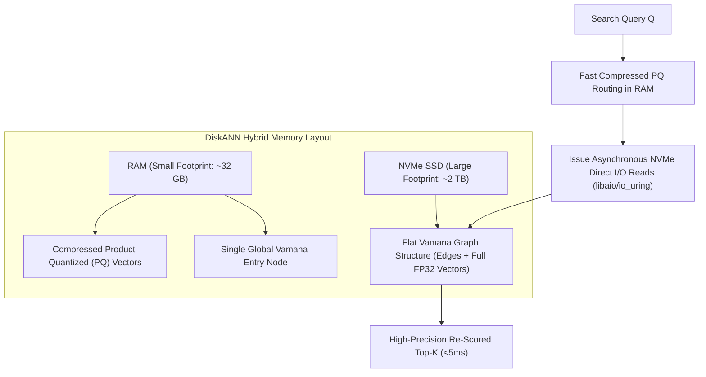

#### Key Innovations of the Vamana Graph:
1. **Single-Layer Graph with Small-World Short-Cuts**: Unlike HNSW's multi-layer hierarchy, Vamana uses a single flat graph with an explicit parameter $\alpha$ (typically $1.2$ to $1.5$) that controls edge inclusion.
2. **Long-Range Edge Optimization**: Higher $\alpha$ values force the graph to retain longer-range edges, allowing searches to traverse the entire metric space in fewer hops.
3. **Sector-Aligned Disk Layout**: The graph adjacency list and the full FP32 vector for each node are packed together into a contiguous $4\text{ KB}$ disk sector. Traversing a node reads both its edges and its exact vector in a **single NVMe read operation**, minimizing disk IOPS.

---

### 2.7 Google SCaNN (Score-Aware Anisotropic Vector Quantization)

Standard vector quantization (like traditional PQ) minimizes **geometric reconstruction error**: $\|\mathbf{x} - \tilde{\mathbf{x}}\|^2$.

However, in Maximum Inner Product Search (MIPS), geometric reconstruction error does **not** correlate directly with ranking error! Errors that are orthogonal to the query vector do not alter dot product rankings nearly as much as parallel errors.

**Google SCaNN** (*Guo et al., 2020*) introduces **Anisotropic Vector Quantization**:

$$\mathcal{L}_{\text{SCaNN}}(\mathbf{x}, \tilde{\mathbf{x}}) = \|\mathbf{x}_{\parallel} - \tilde{\mathbf{x}}_{\parallel}\|^2 + (1 - h) \|\mathbf{x}_{\perp} - \tilde{\mathbf{x}}_{\perp}\|^2$$

By penalizing errors parallel to the data vector far more heavily than perpendicular errors, SCaNN achieves up to **$2\times$ higher QPS at identical recall** compared to standard Faiss IVF-PQ.

---

## Stage 3: Quantization & Memory Compression Techniques

### 3.1 The Memory Crisis: Calculating High-Dimensional Vector RAM Sizing

Vector search algorithms (especially HNSW) demand that all indexed vectors reside in **random access memory (RAM)** to deliver $<10\text{ms}$ search latencies.

#### The Uncompressed FP32 Memory Sizing Formula

$$\text{Vector RAM} = N \times D \times 4\text{ bytes}$$

$$\text{HNSW Graph Overhead} \approx N \times M \times 2 \times 8\text{ bytes}$$

$$\text{Total RAM Required} \approx (N \times D \times 4) \times 1.25\text{ to }1.40$$

Where:
- $N$: Number of vectors.
- $D$: Dimensionality (e.g. 1536 for OpenAI `text-embedding-3-small`).
- $4\text{ bytes}$: Size of a 32-bit floating point number (FP32).

#### Concrete Enterprise Scale Calculations:
- **1,000,000 vectors** ($D = 1536$):
  $$10^6 \times 1536 \times 4\text{ B} \approx 6.14\text{ GB} \implies \mathbf{\approx 8.5\text{ GB with HNSW graph}}$$
- **10,000,000 vectors** ($D = 1536$):
  $$10^7 \times 1536 \times 4\text{ B} \approx 61.4\text{ GB} \implies \mathbf{\approx 85\text{ GB RAM}}$$
- **100,000,000 vectors** ($D = 1536$):
  $$10^8 \times 1536 \times 4\text{ B} \approx 614.4\text{ GB} \implies \mathbf{\approx 850\text{ GB RAM!}}$$

Running high-memory cloud servers with hundreds of gigabytes of RAM costs thousands of dollars monthly. **Quantization is the systems engineering discipline of compressing vector representations to slash RAM usage while preserving search recall.**

---

### 3.2 Scalar Quantization (SQ8): Scaling FP32 to INT8

**Scalar Quantization (SQ8)** compresses each 32-bit float into an 8-bit unsigned integer (`uint8`), reducing raw vector memory by exactly **75% ($4\times$ compression)**:

$$\text{FP32 (4 bytes per dimension)} \xrightarrow{\text{SQ8}} \text{INT8 (1 byte per dimension)}$$

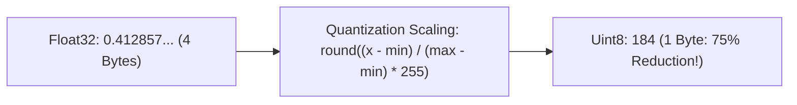

#### The Quantization Scaling Formula
For each dimension $d$, compute the statistical bounds $[\min_d, \max_d]$ across the corpus:

$$q_i = \text{round}\left( 255 \times \frac{v_i - \min_d}{\max_d - \min_d} \right) \in [0, 255]$$

- **Performance**: Retains **$>98\%$ of original uncompressed search recall**.
- **Hardware Acceleration**: Modern CPUs execute INT8 dot products using **AVX-512 VNNI** (Vector Neural Network Instructions), running up to $3\times$ faster than FP32 floating-point math!

---

### 3.3 Product Quantization (PQ): Sub-Vector Codebooks & Lookup Tables

When a $4\times$ reduction (SQ8) is still insufficient, **Product Quantization (PQ)** (*Jégou et al., 2011*) achieves **$16\times$ to $64\times$ compression**.

Instead of quantizing each dimension independently, PQ slices a vector into $M$ smaller sub-vectors and clusters each sub-space independently using k-means:

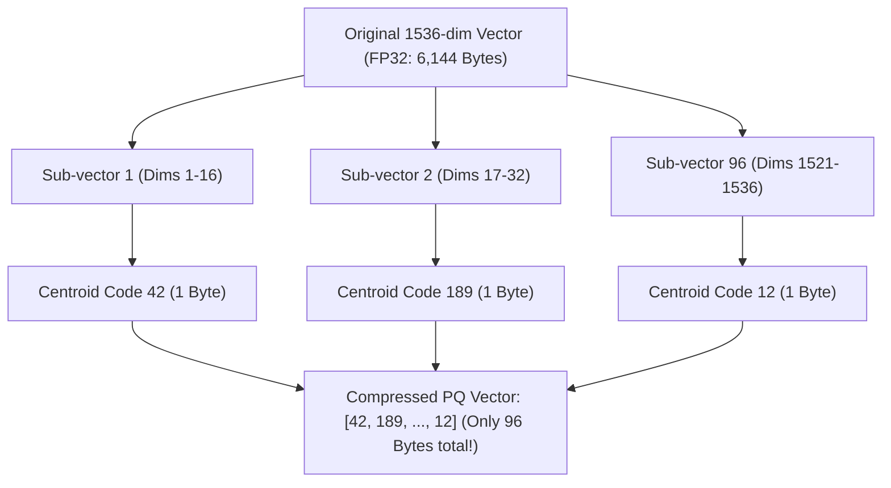

#### How PQ Works:
1. Divide a $D$-dimensional vector into $M$ sub-vectors of dimension $D^* = D / M$ (e.g. $1536 / 96 = 16$ dims each).
2. For each of the $M$ sub-spaces, train a k-means clustering model with $K^* = 256$ centroids.
3. Every sub-vector is assigned to its nearest centroid. Because $K^* = 256$, a centroid index fits in **exactly 1 byte** ($2^8 = 256$).
4. A 1536-dimensional vector is compressed down to **96 bytes** (a **$64\times$ reduction** from 6,144 bytes)!

---

### 3.4 Asymmetric Distance Computation (ADC) vs Symmetric Distance Computation (SDC)

At query time, how do we calculate the distance between an uncompressed Query vector $\mathbf{x}$ and a compressed PQ vector $\mathbf{y}$?

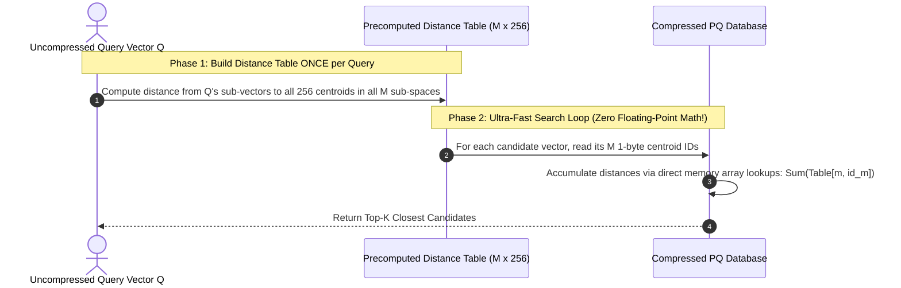

- **Symmetric Distance Computation (SDC)**: Both query and database vectors are quantized. Faster, but suffers from higher quantization error.
- **Asymmetric Distance Computation (ADC)**: The **query vector is NOT quantized**; only the database vectors are quantized. ADC eliminates half of the quantization noise and is the industry gold standard.

---

### 3.5 1-bit Binary Quantization (BQ) & Hardware XOR / POPCNT Acceleration

For maximum compression on massive datasets (e.g. 1 billion vectors), **Binary Quantization (BQ)** reduces each floating-point dimension to a **single bit (0 or 1)** based on whether the coordinate is positive or negative:

$$b_i = \begin{cases} 1 & \text{if } v_i \ge 0 \\ 0 & \text{if } v_i < 0 \end{cases}$$

- **Memory Reduction**: A 1536-dim vector is compressed from **6,144 bytes down to 192 bytes ($32\times$ compression)**!
- **Hardware Superpower**: Computing Hamming distance between two binary vectors requires only two CPU machine instructions:

```c
// Ultra-fast bitwise distance in C / Assembly
int hamming_distance(uint64_t* u, uint64_t* v, int words) {
    int dist = 0;
    for (int i = 0; i < words; ++i) {
        dist += __builtin_popcountll(u[i] ^ v[i]); // XOR then POPCNT in 1 CPU cycle!
    }
    return dist;
}
```

> **Two-Stage Re-Scoring Pattern**: Because BQ has lower precision, production engines use BQ to rapidly filter the Top-1000 candidates via hardware `POPCNT`, then fetch uncompressed FP32 vectors from disk for only those 1000 candidates to re-score the final Top-10.

---

### 3.6 Production Implementation: End-to-End Product Quantizer & ADC in Python

Below is an end-to-end implementation illustrating codebook training, vector quantization, distance lookup table computation, and asymmetric distance search:

```python
import numpy as np
from sklearn.cluster import MiniBatchKMeans

class ProductQuantizer:
    '''
    Production reference implementation of Product Quantization (PQ)
    with Asymmetric Distance Computation (ADC).
    '''
    def __init__(self, d: int, m: int, k_sub: int = 256):
        assert d % m == 0, f"Dimension {d} must be divisible by M={m}"
        self.d = d                  # Total vector dimension (e.g. 128)
        self.m = m                  # Number of sub-quantizers (e.g. 8)
        self.d_sub = d // m         # Dimension per sub-vector (e.g. 16)
        self.k_sub = k_sub          # Number of centroids per subspace (256 = 1 byte)
        self.codebooks = []         # Shape: (M, K_sub, D_sub)

    def fit(self, training_vectors: np.ndarray):
        '''Train M independent MiniBatchKMeans codebooks.'''
        self.codebooks = []
        for m_idx in range(self.m):
            start = m_idx * self.d_sub
            end = start + self.d_sub
            sub_space_data = training_vectors[:, start:end]
            
            kmeans = MiniBatchKMeans(
                n_clusters=self.k_sub, 
                batch_size=2048, 
                random_state=42, 
                n_init='auto'
            )
            kmeans.fit(sub_space_data)
            self.codebooks.append(kmeans.cluster_centers_)
        self.codebooks = np.array(self.codebooks) # Shape: (M, 256, D_sub)

    def encode(self, vectors: np.ndarray) -> np.ndarray:
        '''
        Quantize continuous FP32 vectors into compact uint8 codes.
        Memory output: N vectors x M bytes!
        '''
        n = vectors.shape[0]
        codes = np.zeros((n, self.m), dtype=np.uint8)
        for m_idx in range(self.m):
            start = m_idx * self.d_sub
            end = start + self.d_sub
            sub_vectors = vectors[:, start:end] # (N, D_sub)
            
            # Compute distance to all 256 centroids: (N, 256)
            diff = sub_vectors[:, np.newaxis, :] - self.codebooks[m_idx]
            dists = np.sum(diff ** 2, axis=2)
            codes[:, m_idx] = np.argmin(dists, axis=1).astype(np.uint8)
        return codes

    def search_adc(self, query: np.ndarray, codes: np.ndarray, top_k: int = 5):
        '''
        Asymmetric Distance Computation (ADC):
        1. Precompute distance table of Query sub-vectors against all centroids.
        2. Fast lookup and sum across candidate codes.
        '''
        # Step 1: Precompute (M, 256) Distance Lookup Table
        dist_table = np.zeros((self.m, self.k_sub), dtype=np.float32)
        for m_idx in range(self.m):
            start = m_idx * self.d_sub
            end = start + self.d_sub
            q_sub = query[start:end] # (D_sub,)
            diff = self.codebooks[m_idx] - q_sub # (256, D_sub)
            dist_table[m_idx] = np.sum(diff ** 2, axis=1)

        # Step 2: Accumulate distances using direct integer indexing
        # codes has shape (N, M). We gather distances from dist_table:
        n_vectors = codes.shape[0]
        accumulated_distances = np.zeros(n_vectors, dtype=np.float32)
        for m_idx in range(self.m):
            sub_codes = codes[:, m_idx] # (N,) uint8
            accumulated_distances += dist_table[m_idx, sub_codes]

        top_indices = np.argsort(accumulated_distances)[:top_k]
        return top_indices, accumulated_distances[top_indices]
```

---

### 3.7 Enterprise Quantization Tradeoff Matrix

| Quantization Method | RAM Savings | Recall@10 Loss | Index Build Time | Query Throughput (QPS) | Best Suited Use Case |
| :--- | :--- | :--- | :--- | :--- | :--- |
| **None (FP32)** | $0\times$ (Baseline) | $0\%$ (1.00) | Instant / Minimal | Baseline ($1\times$) | Small corpora ($<500\text{k}$ vectors), mission-critical exact matching. |
| **FP16 / BF16** | $2\times$ | $<0.1\%$ | Very Fast | $1.4\times$ | Standard enterprise baseline when RAM allows. |
| **SQ8 (Scalar INT8)** | $4\times$ | $<1.5\%$ | Fast (1 pass) | $2.5\times$ (AVX-512 VNNI) | **Recommended default** for $>90\%$ of enterprise RAG systems. |
| **PQ (Product Quantization)** | $16\times - 64\times$ | $3\% - 8\%$ | Moderate (k-means) | $3\times - 5\times$ (ADC) | Massive collections ($10\text{M} - 100\text{M}$ vectors) on budget infrastructure. |
| **BQ (Binary 1-bit)** | $32\times$ | $10\% - 20\%$ | Extremely Fast | $10\times - 15\times$ (POPCNT) | Billion-scale preliminary candidate filtering + FP32 re-ranking. |

---

## Stage 4: Database Landscape & Architectural Comparison

### 4.1 Dedicated Specialized Vector DBs vs Vector-Extended Databases

The enterprise database market is divided into two distinct philosophies:

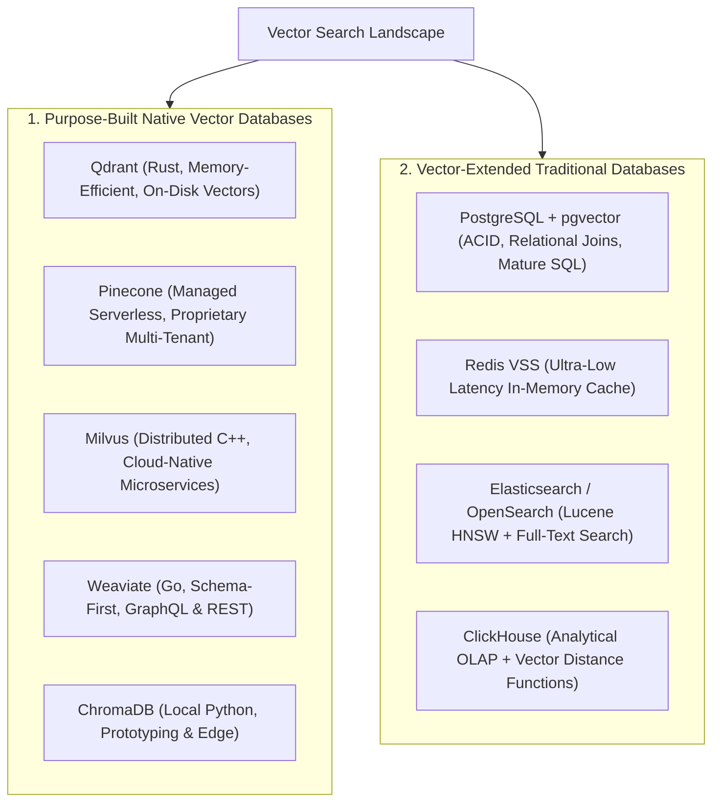

#### Decision Matrix: When to Pick Which Category

| Architectural Requirement | Optimal Architectural Choice | Rationale |
| :--- | :--- | :--- |
| **Existing PostgreSQL Stack & <1M Vectors** | **PostgreSQL (`pgvector`)** | Zero new infrastructure to operate; ACID transactions; direct relational joins between vectors and user tables. |
| **Scale > 50M Vectors & High Write Throughput** | **Qdrant / Milvus** | Specialized SIMD vectorization; decoupled storage/compute; on-disk vector compression. |
| **Zero-Ops Serverless Cloud Deployment** | **Pinecone Serverless** | Managed consumption-based pricing; auto-scaling; zero manual cluster maintenance. |
| **Ultra-Low Latency Cache (<1ms SLA)** | **Redis VSS** | In-memory RAM storage; ideal for real-time fraud detection and recommendation session personalization. |
| **Rich Full-Text Hybrid Search & Log Analysis** | **Elasticsearch / OpenSearch** | Combines mature BM25 Lucene inverted index with HNSW vector fields. |

---

### 4.2 Architectural Breakdown: Qdrant, Pinecone, Milvus, Weaviate, ChromaDB

#### 1. Qdrant (Rust, Production Enterprise Standard)
- **Engine Architecture**: Written in pure Rust for thread-safe concurrency and zero garbage collection pauses.
- **Payload-First Design**: Metadata (payloads) are stored alongside vectors with dedicated B-Tree, Geo, and Keyword indexes.
- **On-Disk MMAP Storage**: Can store vectors on NVMe SSD using memory-mapped files (`mmap`), loading vectors into RAM on-demand while keeping only HNSW graph edges in memory. Reduces RAM costs by up to **80%**!
- **Protocols**: Native high-speed gRPC and REST APIs.

#### 2. Pinecone (Proprietary Managed Serverless)
- **Engine Architecture**: Cloud-native managed SaaS. Separates reads and writes through blob storage (AWS S3) and local SSD caching nodes.
- **Serverless Tier**: Pay-per-query pricing model with automatic partitioning and index management.
- **Limitation**: Closed-source vendor lock-in; cannot run in private isolated on-premise air-gapped VPCs.

#### 3. Milvus (Distributed Cloud-Native C++)
- **Engine Architecture**: Enterprise microservice architecture composed of stateless worker nodes (QueryNode, IndexNode, DataNode) coordinated via etcd, Apache Pulsar/Kafka for log replication, and MinIO/S3 for persistent chunk storage.
- **Scale**: Designed for massive clusters handling **1 billion to 100 billion vectors**.
- **Operational Complexity**: High deployment footprint; requires Kubernetes and deep cloud infrastructure maintenance.

#### 4. Weaviate (Go, GraphQL & Hybrid)
- **Engine Architecture**: Written in Go with C++ graph acceleration modules. Schema-centric with automatic vectorization pipelines (integrating OpenAI, Hugging Face, Cohere models natively).
- **Interface**: Rich GraphQL query language supporting vector, keyword, and hybrid search in a single declarative query.

#### 5. ChromaDB (Local Prototyping & Edge)
- **Engine Architecture**: Lightweight Python/TypeScript database built on top of SQLite and DuckDB.
- **Best Used For**: Local developer development, unit testing in CI, and embedded desktop applications.

---

### 4.3 Relational & Document Extensions: PostgreSQL `pgvector`, Redis VSS, OpenSearch

#### 1. PostgreSQL with `pgvector`
`pgvector` turns standard PostgreSQL into a full-featured vector database:
- **Indexing Options**:
  - `hnsw`: High-performance graph index (Postgres 16+).
  - `ivfflat`: Faster build times, lower RAM, but lower recall on dynamic tables.
- **Distance Operators**:
  - `<->`: Euclidean distance ($L_2$).
  - `<#>`: Negative dot product (Inner Product).
  - `<=>`: Cosine distance.
- **Superpower**: Perform complex SQL relational joins and security filters directly in the same query:

```sql
SELECT p.title, p.price, 1 - (v.embedding <=> $1) AS similarity
FROM product_vectors v
JOIN products p ON v.product_id = p.id
JOIN merchant_stores m ON p.store_id = m.id
WHERE m.is_active = true 
  AND p.price <= 100.00
  AND v.embedding <=> $1 < 0.25
ORDER BY similarity DESC
LIMIT 10;
```

#### 2. Redis VSS (Vector Similarity Search)
- Vectors stored inside Redis Hashes or JSON documents.
- HNSW and Flat indexes defined via RediSearch.
- Sub-millisecond latency for real-time recommendation feeds.

---

### 4.4 Storage Engine Layouts: In-Memory vs MMAP Disk-Backed vs TurboQuant SSD

How vector databases store vectors dictates cost and latency:

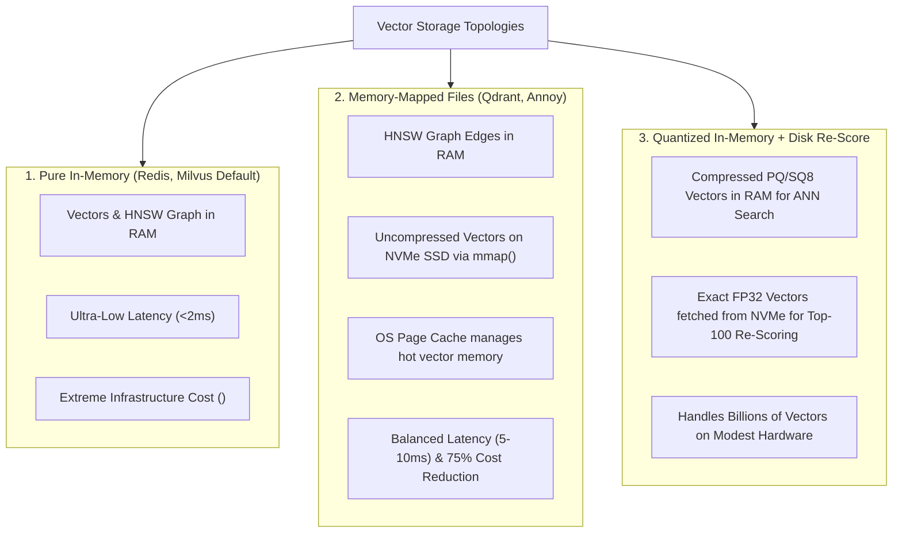

---

### 4.5 Deep Dive into Pinecone Serverless Architecture

Pinecone's **Serverless Architecture** decouples compute from storage to achieve multi-tenant cost efficiency:

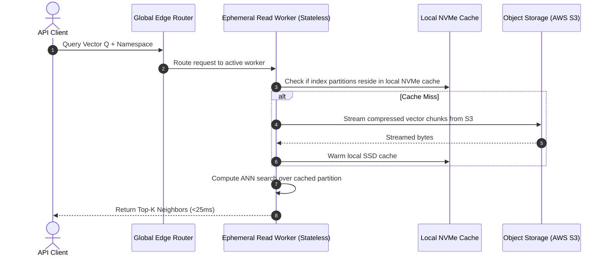

- **Separation of Storage & Compute**: Indexes are stored durably in cloud object storage (S3/GCS), cutting idle storage costs by over **90%** compared to provisioning dedicated EC2 instances with persistent RAM.
- **Dynamic Worker Rehydration**: Query workers pull index slices onto fast local NVMe drives on-demand.
- **Trade-off**: Cold starts on infrequently queried namespaces incur a **50ms–200ms** latency spike on initial access while data warms from S3.

---

### 4.6 Exhaustive Head-to-Head Engine Comparison

| Feature / Metric | PostgreSQL (`pgvector`) | Qdrant | Pinecone Serverless | Milvus | Weaviate |
| :--- | :--- | :--- | :--- | :--- | :--- |
| **Core Language** | C | **Rust** | Proprietary | C++ / Go | Go |
| **Open Source?** | Yes (PostgreSQL License)| **Yes (Apache 2.0)** | No (Proprietary SaaS) | Yes (Apache 2.0) | Yes (BSD-3) |
| **Max Practical Scale** | 10M–50M vectors | **100M–500M+ per node** | Billions (Managed) | Billions (Distributed) | 100M+ |
| **Vector Storage** | Table pages on disk | **NVMe MMAP / RAM** | S3 + Local NVMe | MinIO / S3 Chunks | RAM / Virtual Mem |
| **HNSW Implementation**| Single-layer graph | **Multi-layer HNSW** | Proprietary Graph | Knowhere / Faiss | Custom HNSW |
| **Payload Filtering** | Full SQL (`WHERE`) | **Single-Stage Filter**| Metadata Pre-filter | Boolean Expression | Inverted Index |
| **ACID Guarantees** | **Full Relational ACID**| Eventual / WAL | Eventual Consistency | Eventual / Log-based | Eventual Consistency|
| **Quantization** | FP16, 1-bit BQ | **INT8 SQ, PQ, BQ** | Automatic Managed | SQ8, PQ, BQ | SQ8, PQ |
| **Deployment Footprint**| Standard Postgres | **Single lightweight binary** | Zero-Ops API | Multi-pod Kubernetes | Container cluster |

---

## Stage 5: Metadata Filtering, Multi-Tenancy & Hybrid Search

### 5.1 The Filtering Dilemma: Post-Filtering vs Pre-Filtering Recall Collapse

In production applications, vector queries almost never search the entire database in isolation. They are constrained by **business metadata**:
- *"Find similar documents created by User #42 in the year 2026."*
- *"Find matching products in the 'Electronics' category with price under $200."*

Combining metadata filters with vector search presents a major algorithmic dilemma:

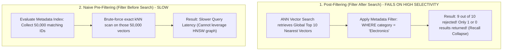

1. **Post-Filtering**: Runs standard HNSW search first to fetch the Top-$K$ neighbors, then discards candidates that do not match the filter.
   - **The Collapse**: If only 0.5% of documents match the filter condition, the top-10 nearest neighbors from HNSW will likely contain **zero** matching items, returning an empty result set!
2. **Naive Pre-Filtering**: Queries the metadata index first to find all matching document IDs, then performs a brute-force exact scan on those IDs.
   - **The Bottleneck**: Bypasses the HNSW graph, causing high query latency when the matching candidate set is large (e.g. 100,000 items).

---

### 5.2 Single-Stage Payload-Filtered HNSW Graph Traversal

Modern vector engines (pioneered by **Qdrant**) solve the filtering dilemma with **Single-Stage Filtered Graph Traversal**:

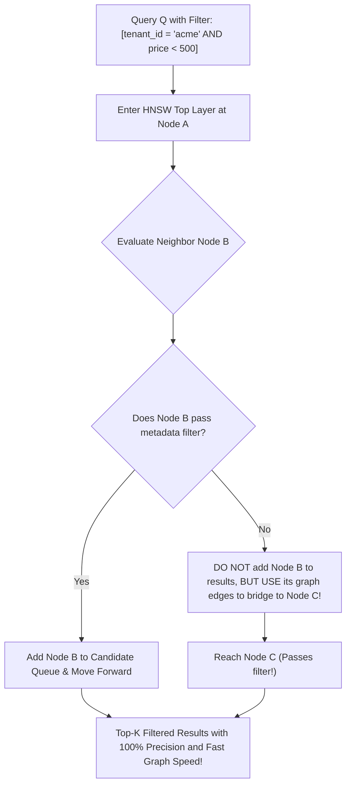

#### How Single-Stage Filtered HNSW Works:
1. The search algorithm navigates the HNSW graph as normal.
2. At each node evaluation, the engine checks the payload condition using a secondary payload index (e.g. in-memory boolean bitmap or roaring bitmap).
3. **If a node fails the filter**, it is **not** added to the top-$K$ candidate result set, **but the search algorithm is allowed to hop through it** as a navigational bridge to reach valid nodes further in the graph!
4. Graph connectivity is preserved, completely preventing both recall collapse and brute-force degradations.

---

### 5.3 Multi-Tenancy Isolation Patterns: Namespaces vs Collections vs Partition Keys

When building multi-tenant B2B SaaS platforms hosting thousands of enterprise customers, isolating tenant data is critical:

| Pattern | Architectural Mechanism | Pros | Cons / Scaling Limits |
| :--- | :--- | :--- | :--- |
| **Collection-Per-Tenant** | Each tenant gets an independent HNSW index / collection. | 100% hard physical isolation. Trivial tenant deletion. | **Horrible scaling**. 10,000 tenants creates 10,000 distinct HNSW graphs in RAM, crashing cluster memory. Fails when $T > 100$. |
| **Namespace Isolation** | Partitioned logical namespaces within a single collection (e.g. Pinecone). | Clean logical separation; easier management than collections. | Still allocates metadata overhead per namespace. |
| **Single Shared Collection with Partition Key Index (Recommended)** | All tenants share one collection. Every vector includes `tenant_id` in its payload. | **Maximum resource efficiency**. Supports millions of tenants on modest hardware. | Requires mandatory payload filtering on every query to prevent data leaks. |

#### Production Multi-Tenant Query in Qdrant (Rust/Python)

```python
from qdrant_client import QdrantClient
from qdrant_client.models import Filter, FieldCondition, MatchValue

client = QdrantClient(host="localhost", port=6333)

# Search strictly within Tenant Acme Corp's private data boundary
search_results = client.search(
    collection_name="enterprise_knowledge",
    query_vector=[0.012, -0.045, 0.219, 0.812],
    query_filter=Filter(
        must=[
            # Hard Multi-Tenant Isolation
            FieldCondition(
                key="tenant_id",
                match=MatchValue(value="tenant_acme_corp")
            ),
            # Business Permission Filter
            FieldCondition(
                key="is_confidential",
                match=MatchValue(value=False)
            )
        ]
    ),
    limit=5
)
```

---

### 5.4 Hybrid Search: Fusing Vector Proximity with Inverted Text Indexes

Modern vector databases (Qdrant, Milvus, Weaviate) embed native inverted indexes directly into the vector engine, allowing unified **Hybrid Search** with a single API call:

```python
# Unified Hybrid Search with Reciprocal Rank Fusion in Qdrant v1.10+
from qdrant_client.models import Prefetch, FusionQuery, Fusion

results = client.query_points(
    collection_name="all_documents",
    prefetch=[
        # Sub-query 1: Dense Vector Search
        Prefetch(
            query=[0.012, -0.045, 0.111, 0.999],
            using="dense_vector",
            limit=25
        ),
        # Sub-query 2: Sparse SPLADE / BM25 Lexical Search
        Prefetch(
            query=client.create_sparse_query("CVE-2024-38077 buffer overflow"),
            using="sparse_lexical",
            limit=25
        )
    ],
    # Fuse candidate lists using Reciprocal Rank Fusion in real-time
    query=FusionQuery(fusion=Fusion.RRF),
    limit=10
)
```

---

### 5.5 Dynamic Tenant Rebalancing & Mitigating "Noisy Neighbors"

In multi-tenant SaaS systems, vector sizes and query volumes vary wildly:
- 95% of tenants have $<10,000$ vectors and query 5 times/day.
- 5% of enterprise "whale" tenants have $50,000,000$ vectors and query 200 times/second.

#### The Noisy Neighbor Problem
If a whale tenant triggers massive background batch insertions, HNSW graph construction consumes 100% of CPU cores on the shared node, causing query latencies for all smaller tenants on that node to spike from $5\text{ms}$ to $500\text{ms}$!

#### Architectural Cures:
1. **Tiered Sharding Strategy**: Small tenants share a dense multi-tenant pool. Whale tenants are automatically detected and partitioned onto dedicated physical worker nodes.
2. **Per-Tenant Rate Limiting & CPU Cgroups**: Linux cgroups and application token-bucket rate limiters throttle indexing threads per tenant.
3. **Partition Key Routing**: Directs queries for a specific tenant directly to the specific shard hosting that tenant, avoiding global cluster scatter-gather operations.

---

### 5.6 Filter Optimization with Roaring Bitmaps

To evaluate metadata conditions at microsecond speeds during HNSW graph hops, vector engines do not run SQL parsers; they use **Roaring Bitmaps**:

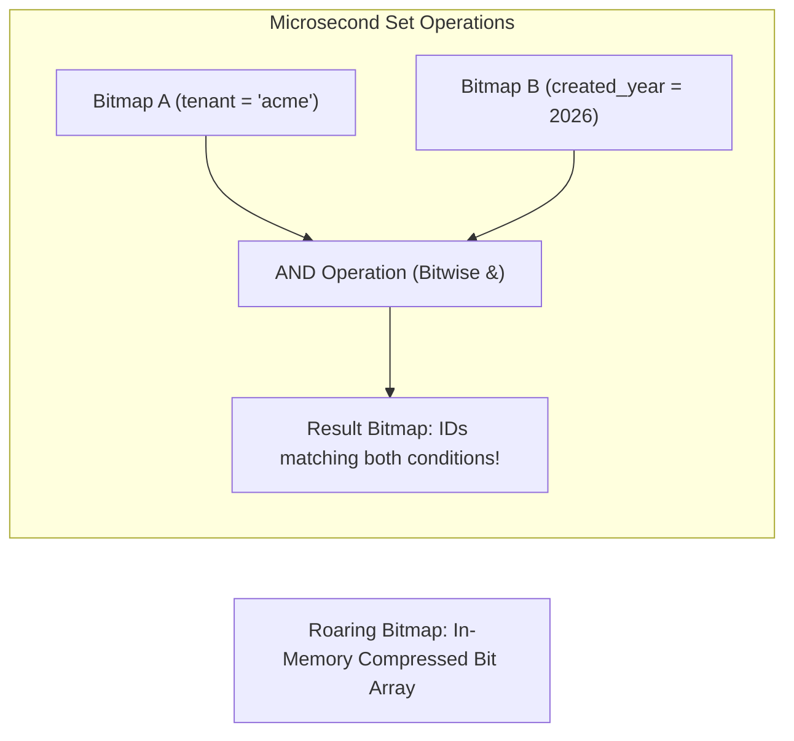

- **Compression**: Roaring Bitmaps automatically adapt between dense bitsets, arrays of 16-bit integers, and run-length encoded (RLE) runs.
- **Speed**: Evaluating whether vector ID #492,014 belongs to Tenant Acme requires a single bitwise shift and mask operation, executing in $<2\text{ nanoseconds}$!

---

### 5.7 Enterprise Multi-Tenancy in Milvus & Weaviate

#### A. Milvus Partition Keys
Milvus v2.4+ provides native `partition_key` support. When a field is designated as the partition key, Milvus automatically computes a hash and routes vectors directly to dedicated physical partitions:

```python
from pymilvus import CollectionSchema, FieldSchema, DataType, Collection

# Define schema with partition_key enabled on tenant_id
fields = [
    FieldSchema(name="id", dtype=DataType.INT64, is_primary=True, auto_id=True),
    FieldSchema(name="tenant_id", dtype=DataType.VARCHAR, max_length=64, is_partition_key=True),
    FieldSchema(name="embedding", dtype=DataType.FLOAT_VECTOR, dim=1536)
]
schema = CollectionSchema(fields, description="Multi-tenant Enterprise Knowledgebase")
collection = Collection("tenant_documents", schema=schema)

# Query automatically routes to only partitions assigned to 'tenant_acme'
res = collection.search(
    data=[[0.051, -0.012, 0.441, 0.109]],
    anns_field="embedding",
    param={"metric_type": "COSINE", "params": {"ef": 64}},
    limit=5,
    expr='tenant_id == "tenant_acme"'
)
```

#### B. Weaviate Dynamic Tenant States (Active, Inactive, Offloaded to S3)
Weaviate allows collections to declare `multi_tenancy_config(enabled=True)`. Each tenant's index can dynamically transition between:
- **`HOT / ACTIVE`**: Loaded in RAM, $<5\text{ms}$ query latency.
- **`COLD / INACTIVE`**: Offloaded to local disk or NVMe, 0 RAM usage.
- **`OFFLOADED`**: Shipped to AWS S3 / Cloud Storage, freeing disk space for dormant accounts.

```python
import weaviate
import weaviate.classes.config as wvc
from weaviate.classes.tenants import Tenant, TenantActivityStatus

client = weaviate.connect_to_local()

# Enable native multi-tenancy on collection
client.collections.create(
    name="SaaSKnowledge",
    multi_tenancy_config=wvc.Configure.multi_tenancy(enabled=True),
    properties=[wvc.Property(name="content", data_type=wvc.DataType.TEXT)]
)

# Manage tenant lifecycle dynamically
col = client.collections.get("SaaSKnowledge")
col.tenants.create([
    Tenant(name="active_client_1", activity_status=TenantActivityStatus.HOT),
    Tenant(name="dormant_client_9", activity_status=TenantActivityStatus.COLD)
])
```

---

### 5.8 Custom Hybrid Ranker: Reciprocal Rank Fusion (RRF) & Cross-Encoder

In high-accuracy enterprise RAG systems, fusing dense semantic candidates with sparse lexical candidates using **Reciprocal Rank Fusion (RRF)**, followed by a **Cross-Encoder Reranker**, achieves peak Recall@5:

```python
from typing import List, Dict, Any

def reciprocal_rank_fusion(
    dense_results: List[Dict[str, Any]], 
    sparse_results: List[Dict[str, Any]], 
    k: int = 60
) -> List[Dict[str, Any]]:
    '''
    Fuses two ranked lists using Reciprocal Rank Fusion:
    RRF_score(d) = sum(1 / (k + rank_i(d)))
    '''
    scores: Dict[str, float] = {}
    doc_lookup: Dict[str, Dict[str, Any]] = {}

    for rank, doc in enumerate(dense_results):
        doc_id = doc["id"]
        doc_lookup[doc_id] = doc
        scores[doc_id] = scores.get(doc_id, 0.0) + (1.0 / (k + rank + 1))

    for rank, doc in enumerate(sparse_results):
        doc_id = doc["id"]
        doc_lookup[doc_id] = doc
        scores[doc_id] = scores.get(doc_id, 0.0) + (1.0 / (k + rank + 1))

    # Sort documents by accumulated RRF score descending
    sorted_doc_ids = sorted(scores.keys(), key=lambda did: scores[did], reverse=True)
    fused_results = []
    for doc_id in sorted_doc_ids:
        doc = doc_lookup[doc_id].copy()
        doc["rrf_score"] = scores[doc_id]
        fused_results.append(doc)
    return fused_results
```

---

## Stage 6: Distributed Scaling, Sharding & Production Operations

### 6.1 Distributed Topologies: Coordinators, Shard Replicas & Raft Consensus

When scaling past hundreds of millions of vectors, a single machine's RAM and CPU core capacity is exhausted. Distributed vector databases (such as **Qdrant Distributed**, **Milvus Distributed**, and **Pinecone**) adopt clustered architectures:

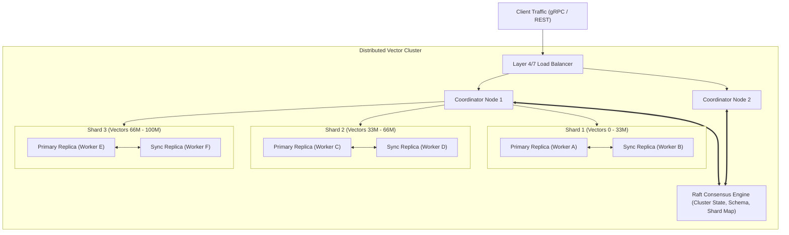

#### How Clustered Vector Search Works:
1. **Scatter-Gather Execution**: The client sends a query to any Coordinator Node.
2. The Coordinator hashes the filter / partition key to determine target shards. If unpartitioned, it **scatters** the query vector in parallel to all active shard primaries.
3. Each shard independently traverses its local HNSW index to retrieve its local Top-$K$ candidates.
4. Shards return their candidate lists to the Coordinator, which **gathers**, deduplicates, sorts by distance, and returns the global Top-$K$ result set to the client.

---

### 6.2 High-Throughput Write Pipelines: WAL, Segment Immutability & Compaction

Inserting vectors into an active HNSW graph requires updating hundreds of graph pointers, causing lock contention and high latency.

Modern vector engines adopt **LSM-Tree-inspired Segmented Storage**:

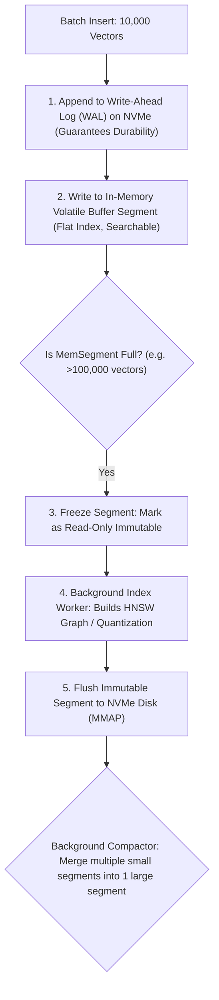

- **Zero Write Blocking**: Real-time inserts append to the in-memory buffer segment in microseconds without blocking active queries on immutable segments.
- **Background Graph Building**: Heavy HNSW graph edge updates run asynchronously on background worker threads.
- **Segment Compaction**: As vectors are deleted or updated, background garbage collectors vacuum obsolete points and merge fragmented segments into compact, optimized HNSW graphs.

---

### 6.3 Hardware Acceleration: SIMD, AVX-512, and ARM Neon Vectorization

Computing dot products and Euclidean distances across thousands of 1536-dimensional vectors is the primary CPU bottleneck of vector databases.

Modern vector engines use **SIMD (Single Instruction, Multiple Data)** hardware vector registers:

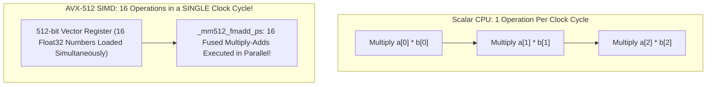

#### Hardware Instruction Sets Supported:
- **x86_64 Intel/AMD**: AVX-2 (256-bit: 8 floats/cycle), AVX-512 (512-bit: 16 floats/cycle), and AVX-512 VNNI (INT8 quantization acceleration).
- **Apple Silicon / AWS Graviton (ARM64)**: ARM Neon (128-bit: 4 floats/cycle) and SVE (Scalable Vector Extensions).

Enabling native SIMD acceleration increases search throughput (QPS) by **$400\%$ to $800\%$** compared to unvectorized compiler code.

---

### 6.4 Snapshot Backups, Recovery & Zero-Downtime Index Rebuilding

#### 1. Consistent Point-in-Time Snapshots
Vector databases create snapshots without pausing search queries by freezing active segment files and leveraging filesystem copy-on-write (COW) hard links:

```bash
# Create consistent cluster snapshot via Qdrant REST API
curl -X POST "http://localhost:6333/collections/enterprise_docs/snapshots"
```

#### 2. Zero-Downtime Index Rebuilding (Blue-Green Collections)
When upgrading an embedding model ($D=768 \rightarrow D=1536$) or altering HNSW hyperparameters ($M=16 \rightarrow M=32$):
1. Create a shadow collection: `enterprise_docs_v2`.
2. Ingest and build the new HNSW index in the background without affecting production queries.
3. Atomic Collection Alias Swap: Switch client traffic instantly with zero downtime:
   ```bash
   curl -X POST "http://localhost:6333/collections/aliases" \
     -H "Content-Type: application/json" \
     -d '{
       "actions": [
         { "change_alias": { "alias_name": "production_docs", "collection_name": "enterprise_docs_v2" } }
       ]
     }'
   ```

---

### 6.5 High-Throughput Stream Ingestion with Apache Kafka

Inserting vectors point-by-point over individual HTTP REST calls degrades ingestion throughput. An enterprise streaming pipeline buffers and micro-batches vectors:

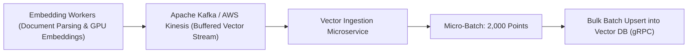

- **Backpressure Protection**: If the vector database is performing segment compaction, Kafka absorbs ingestion spikes without dropping data or overwhelming database workers.
- **Batch Size Optimization**: Micro-batches of $1,000$ to $5,000$ vectors maximize disk IOPS and network throughput.

---

### 6.6 Linux OS Page Cache Tuning for On-Disk Vector Storage

When running on-disk vector databases using `mmap()` (like Qdrant or Milvus), Linux kernel virtual memory settings directly impact query latency:

```bash
# Production Linux sysctl tuning for Vector Databases (/etc/sysctl.conf)

# 1. Reduce aggressive swapping; keep vector memory in RAM
vm.swappiness = 1

# 2. Control dirty memory writeback to prevent NVMe I/O lockups during background writes
vm.dirty_background_ratio = 5
vm.dirty_ratio = 10

# 3. Increase maximum memory-mapped file count for large segment indexes
vm.max_map_count = 1048576

# 4. Retain dentries and inodes in page cache for fast segment lookup
vm.vfs_cache_pressure = 50
```

---

## Stage 7: Staff Vector Architect: Enterprise Blueprint, Benchmarks & 50 Interview Q&As

### 7.1 Production Enterprise Blueprint: Qdrant Multi-Tenant Microservice with Filtering

Below is an enterprise-grade production microservice in Python demonstrating Qdrant collection creation with custom HNSW hyperparameters, Scalar Quantization, Payload Indexes, and batch upsert pipelines.

```python
# src/vector_service.py
from qdrant_client import QdrantClient
from qdrant_client.models import (
    Distance,
    VectorParams,
    HnswConfigDiff,
    ScalarQuantization,
    ScalarQuantizationConfig,
    ScalarType,
    PayloadSchemaType,
    PointStruct,
    Filter,
    FieldCondition,
    MatchValue,
    Range
)
import uuid

class EnterpriseVectorStore:
    def __init__(self, host: str = "localhost", port: int = 6333):
        self.client = QdrantClient(host=host, port=port)
        self.collection_name = "enterprise_knowledge_base"

    def initialize_collection(self):
        '''Sets up high-performance collection with HNSW, SQ8, and On-Disk Vectors.'''
        if self.client.collection_exists(self.collection_name):
            print(f"Collection {self.collection_name} already exists.")
            return

        self.client.create_collection(
            collection_name=self.collection_name,
            # Vector configuration: 1536 dims, Cosine similarity, On-Disk storage
            vectors_config=VectorParams(
                size=1536,
                distance=Distance.COSINE,
                on_disk=True # Store uncompressed vectors on NVMe to slash RAM!
            ),
            # HNSW Graph Hyperparameters
            hnsw_config=HnswConfigDiff(
                m=16,                # 16 edges per node (balanced RAM vs recall)
                ef_construct=128,    # High construction queue for optimal graph connectivity
                full_scan_threshold=10000,
                on_disk=False        # Keep HNSW graph edges in RAM for maximum search speed
            ),
            # Enable 8-bit Scalar Quantization (SQ8: 4x RAM reduction)
            quantization_config=ScalarQuantization(
                scalar=ScalarQuantizationConfig(
                    type=ScalarType.INT8,
                    quantile=0.99,   # Exclude 1% extreme outliers for better quantization scaling
                    always_ram=True  # Keep compressed quantized vectors in RAM for fast search
                )
            )
        )

        # Create payload index for tenant isolation (B-Tree index)
        self.client.create_payload_index(
            collection_name=self.collection_name,
            field_name="tenant_id",
            field_schema=PayloadSchemaType.KEYWORD
        )

        # Create payload index for numerical range filtering
        self.client.create_payload_index(
            collection_name=self.collection_name,
            field_name="created_timestamp",
            field_schema=PayloadSchemaType.INTEGER
        )
        print("Collection and payload indexes initialized successfully.")

    def batch_upsert_documents(self, tenant_id: str, documents: list[dict]):
        '''Batches vector insertions with structured business metadata.'''
        points = []
        for doc in documents:
            points.append(
                PointStruct(
                    id=str(uuid.uuid4()),
                    vector=doc["embedding"], # 1536 float list
                    payload={
                        "tenant_id": tenant_id,
                        "document_id": doc["document_id"],
                        "content": doc["content"],
                        "created_timestamp": doc["created_timestamp"],
                        "is_active": True
                    }
                )
            )

        # Execute high-throughput batch insert
        self.client.upsert(
            collection_name=self.collection_name,
            points=points,
            wait=True # Wait for WAL durability
        )
        print(f"Upserted {len(points)} vectors for tenant {tenant_id}.")

    def search_tenant_documents(self, tenant_id: str, query_vector: list[float], top_k: int = 5):
        '''Single-stage payload-filtered HNSW query.'''
        results = self.client.search(
            collection_name=self.collection_name,
            query_vector=query_vector,
            query_filter=Filter(
                must=[
                    FieldCondition(key="tenant_id", match=MatchValue(value=tenant_id)),
                    FieldCondition(key="is_active", match=MatchValue(value=True))
                ]
            ),
            limit=top_k,
            search_params={"hnsw_ef": 64} # Dynamic efSearch query tuning!
        )
        return results
```

---

### 7.2 The ANN-Benchmarks Methodology: Recall@K vs QPS vs Build Latency

In production vector search evaluations, marketing claims like *"10x faster"* are meaningless without standardized benchmarking metrics. The industry relies on the **ANN-Benchmarks** (*Aumüller et al.*) methodology:

```mermaid
graph LR
    subgraph Metrics["The 4 Dimensional Vector Benchmark Framework"]
        M1["1. Recall@K: % of true ground-truth nearest neighbors found"]
        M2["2. Queries Per Second (QPS): System query throughput under load"]
        M3["3. Index Build Time & Ingestion Rate: Vectors indexed per second"]
        M4["4. Memory Saturation: RAM & Disk footprint in bytes per vector"]
    end
```

#### How to Measure True Recall@K:
1. **Compute Ground Truth**: Run an exact brute-force linear scan (Flat index) to find the absolute true $K$ nearest neighbors for 10,000 test queries: $G_q$.
2. **Execute ANN Query**: Run the identical 10,000 queries against the approximate index (HNSW / IVF) to retrieve candidate set: $A_q$.
3. **Compute Set Intersection**:
   $$\text{Recall@K} = \frac{1}{|Q|} \sum_{q \in Q} \frac{|A_q \cap G_q|}{K}$$

A production vector system typically targets **$\text{Recall@10} \ge 98.0\%$ at $\ge 1,000\text{ QPS}$ per node**.

---

### 7.3 50 Staff-Level Vector Database Technical Interview Questions & Answers

#### Category 1: Vector Mathematics, Metrics & High-Dimensional Geometry (Q1–Q10)

##### Q1: What causes the Curse of Dimensionality in vector spaces, and how does it affect distance distributions?
**Answer:** In high dimensions ($D > 100$), the ratio of volume between an inscribed hypersphere and a bounding hypercube approaches zero: $\lim_{D \rightarrow \infty} \frac{V_{\text{sphere}}}{V_{\text{cube}}} = 0$. Furthermore, the variance of pairwise distances between points decreases relative to the mean distance: $\lim_{D \rightarrow \infty} \frac{\sigma_{\text{dist}}}{\mu_{\text{dist}}} = 0$. This distance concentration phenomenon means that all points in the dataset become approximately equidistant from the query point. Consequently, partitioning structures like k-d trees and B-trees must inspect almost every partition, degrading to $O(N)$ linear scans.

##### Q2: Why is Squared Euclidean Distance preferred over standard Euclidean Distance during vector indexing?
**Answer:** Euclidean distance is $\sqrt{\sum (u_i - v_i)^2}$. The square root function ($\sqrt{\cdot}$) is strictly monotonic: for all $a, b \ge 0$, $a < b \iff \sqrt{a} < \sqrt{b}$. Computing the square root on modern CPUs requires multiple clock cycles and cannot be vectorized as efficiently as fused multiply-add (FMA). Omitting the square root yields identical distance rankings while significantly reducing CPU instruction overhead.

##### Q3: Prove why Cosine Similarity and Dot Product produce identical rankings on $L_2$-normalized vectors.
**Answer:** The Euclidean distance squared between two unit-normalized vectors ($\|\mathbf{u}\| = \|\mathbf{v}\| = 1$) expands to:
$$\|\mathbf{u} - \mathbf{v}\|^2 = \|\mathbf{u}\|^2 + \|\mathbf{v}\|^2 - 2(\mathbf{u} \cdot \mathbf{v}) = 1 + 1 - 2(\mathbf{u} \cdot \mathbf{v}) = 2 - 2(\mathbf{u} \cdot \mathbf{v})$$
Because $\cos(\theta) = \frac{\mathbf{u} \cdot \mathbf{v}}{\|\mathbf{u}\| \|\mathbf{v}\|} = \mathbf{u} \cdot \mathbf{v}$, we have:
$$d_{L_2}^2(\mathbf{u}, \mathbf{v}) = 2(1 - \cos(\theta))$$
Maximizing Cosine Similarity is algebraically identical to maximizing the Dot Product and minimizing Euclidean Distance.

##### Q4: What is Manhattan Distance ($L_1$), and when is it preferred over Euclidean Distance ($L_2$)?
**Answer:** Manhattan distance is the sum of absolute coordinate differences: $\sum |u_i - v_i|$. As proven by *Aggarwal et al.*, for high-dimensional applications, $L_p$ norms with lower values of $p$ (like $L_1$) preserve distance contrast significantly better than higher norms ($L_2$ or $L_\infty$) as dimensionality increases. It is also less sensitive to extreme outliers along individual feature dimensions.

##### Q5: What is Hamming distance, and how do modern CPUs accelerate it in hardware?
**Answer:** Hamming distance measures the number of bit positions in which two binary vectors differ. Modern x86_64 and ARM CPUs provide dedicated assembly instructions: the bitwise `XOR` instruction followed by `POPCNT` (Population Count). A 512-dimensional binary vector fits in an AVX-512 register; computing its Hamming distance requires only **1 to 2 CPU clock cycles**.

##### Q6: How does vector magnitude affect Dot Product similarity compared to Cosine Similarity?
**Answer:** Dot Product ($\mathbf{u} \cdot \mathbf{v} = \|\mathbf{u}\| \|\mathbf{v}\| \cos(\theta)$) scales linearly with vector magnitude. If a document vector has an artificially large norm, its dot product with the query will be massive, even if their directional angle is wide. Cosine similarity divides by vector norms, isolating pure angular direction regardless of document length or feature scale.

##### Q7: What is the Hubness Problem in high-dimensional nearest-neighbor graphs?
**Answer:** In high dimensions, certain data points (called "hubs") become the nearest neighbors to an abnormally large number of other points across the dataset, regardless of semantic meaning. In graph-based indexes (like NSW), hubs create routing bottlenecks and degrade navigation diversity. HNSW mitigates this via heuristic edge selection that enforces spatial diversity.

##### Q8: What is the difference between dense and sparse vector spaces in terms of linear algebra?
**Answer:** Dense vectors exist in continuous low-dimensional spaces ($D \sim 10^3$) where coordinates are non-zero real numbers; operations rely on matrix multiplications (BLAS/LAPACK). Sparse vectors exist in extremely high-dimensional spaces ($D \sim 10^5$) where $>99.9\%$ of coordinates are zero; operations rely on inverted posting lists and sparse dot products (evaluating only the intersection of non-zero indices).

##### Q9: Can you store both dense and sparse vectors in the same database point in Qdrant or Milvus?
**Answer:** Yes. Modern engines support **Named Vectors** (multivector support), allowing a single document point to store both a 1536-dimensional dense embedding (for conceptual semantic search) and a 30,000-dimensional sparse vector (for exact BM25 keyword matching).

##### Q10: How does floating-point precision (FP32 vs FP16 vs BF16) affect vector similarity accuracy?
**Answer:** FP32 uses 1 sign bit, 8 exponent bits, and 23 mantissa bits. FP16 uses 1 sign, 5 exponent, and 10 mantissa bits. In vector similarity, the relative ordering of distances is remarkably resilient to slight precision degradation; switching from FP32 to FP16 reduces memory by 50% with $<0.1\%$ difference in Recall@10.

---

#### Category 2: Indexing Algorithms (HNSW, IVF, Annoy) (Q11–Q20)

##### Q11: Explain the mathematical intuition behind HNSW's skip-list hierarchy.
**Answer:** In a standard 1D Skip-List, elements are randomly promoted to higher layers with probability $p$, creating express lanes that enable $O(\log N)$ search over linked lists. HNSW generalizes this to graphs: each node is assigned a maximum layer $l = \lfloor -\ln(\text{uniform}(0, 1)) \cdot m_L \rfloor$. The top layer contains a very sparse graph with long-range edges for coarse, rapid exploration across the entire metric space. As search descends to Layer 0, the graph becomes dense with short-range edges for fine-grained local clustering.

##### Q12: What does the parameter $M$ in HNSW control, and what is the rule for Layer 0?
**Answer:** $M$ defines the maximum number of bidirectional connections (edges) each node can maintain in layers $> 0$. On the ground layer (Layer 0), the maximum degree is configured as $M_0 = 2M$. Because Layer 0 holds 100% of all vectors, doubling its connectivity ensures dense local clustering and prevents graph disconnections.

##### Q13: What is the purpose of $efConstruction$ vs $efSearch$ in HNSW?
**Answer:** Both control the size of the dynamic priority queue of candidate neighbors during search. $efConstruction$ is used when inserting a new vector into the graph during index build; higher values build a higher-quality graph with better global connectivity. $efSearch$ is used at query time; it controls how extensively the search algorithm explores the neighborhood on Layer 0 before returning the Top-$K$ results.

##### Q14: How does HNSW's Heuristic Edge Selection prevent redundant graph clusters?
**Answer:** A naive algorithm connects a new node to its $M$ nearest neighbors. However, if those neighbors are all tightly clustered together, they provide redundant routing directions. HNSW's heuristic selects a neighbor only if it is closer to the base node than to any already-selected neighbor. This enforces **directional diversity**, ensuring edges fan out like spokes on a wheel in all directions.

##### Q15: In an Inverted File (IVF) index, why does increasing $nprobe$ improve recall but lower QPS?
**Answer:** IVF partitions vectors into `nlist` Voronoi cells. At query time, `nprobe` dictates how many of the closest centroid cells to scan. If $\text{nprobe} = 1$, only 1 cell is scanned; vectors belonging to the query that fell across a cell boundary are missed. Increasing $\text{nprobe}$ scans more cells, capturing boundary vectors and improving recall, but linearly increases the number of distance calculations, reducing throughput (QPS).

##### Q16: How do you choose the optimal `nlist` parameter for an IVF index?
**Answer:** Standard empirical rule: $\text{nlist} \approx 4\sqrt{N}$ to $16\sqrt{N}$, where $N$ is total vectors. For $1,000,000$ vectors, $\sqrt{N} = 1,000$, yielding an optimal `nlist` between $4,000$ and $16,000$.

##### Q17: What is the primary operational drawback of tree-based Annoy indexes compared to HNSW?
**Answer:** Annoy builds static, immutable binary tree forests. Once built, the index cannot accept incremental inserts or deletions. Adding a single new vector requires re-clustering and rebuilding the entire forest from scratch. In contrast, HNSW supports dynamic real-time inserts and deletions.

##### Q18: What is Graph Disconnection in HNSW and how can it occur?
**Answer:** If vectors are deleted from an HNSW graph without repairing neighbor edges, or if $M$ is configured too small ($M < 4$) on disconnected multi-modal data, the graph can fracture into isolated sub-graphs. A query entering the graph in one component can never reach the other component, resulting in severe recall collapse.

##### Q19: How does HNSW handle node deletions in production engines?
**Answer:** Deleting a node directly from an in-memory graph is expensive because all incoming edges must be redirected. Modern engines (like Qdrant) use **Tombstoning**: the node is marked as deleted in a bitmap (ignored during queries), and background compaction routines rebuild clean graph segments asynchronously.

##### Q20: What is the time complexity of an HNSW query with respect to dataset size $N$?
**Answer:** Search complexity in HNSW scales logarithmically: **$O(\log N)$**. Each layer traversal takes $O(1)$ greedy steps, and the number of layers scales as $O(\log N)$.

---

#### Category 3: Quantization & Compression (Q21–Q30)

##### Q21: Explain how Product Quantization (PQ) decomposes high-dimensional metric space.
**Answer:** PQ decomposes a $D$-dimensional space into a Cartesian product of $M$ orthogonal low-dimensional subspaces: $\mathbb{R}^D = \mathbb{R}^{D^*} \times \dots \times \mathbb{R}^{D^*}$, where $D^* = D / M$. For each subspace, k-means clusters sub-vectors into $K^* = 256$ centroids. Any vector is represented by $M$ centroid indices (each fitting in 1 byte).

##### Q22: What is the difference between ADC (Asymmetric Distance Computation) and SDC (Symmetric Distance Computation) in PQ?
**Answer:**
- **SDC**: Both the database vectors and the query vector are quantized. Distance is computed between centroid codebooks.
- **ADC**: The query vector is left uncompressed; only database vectors are quantized. The query computes exact distances to the 256 centroids per subspace once, storing them in an $M \times 256$ lookup table. ADC is far more accurate than SDC with identical search time.

##### Q23: Why does Product Quantization require an initial "training" phase?
**Answer:** PQ must learn the optimal centroid codebooks for each subspace via k-means clustering. This requires running training iterations across a representative sample (typically 50,000 to 250,000 vectors) to minimize quantization distortion error before encoding database vectors.

##### Q24: What is Scalar Quantization (SQ8) dynamic range clipping via quantiles?
**Answer:** If a dataset has extreme outliers (e.g. one dimension with a value of $+12.0$ while $99.9\%$ of values fall between $-0.5$ and $+0.5$), naive min-max scaling will compress the entire meaningful range into a tiny fraction of the 256 integer buckets. Quantile clipping sets bounds at statistical quantiles (e.g. 0.005 and 0.995 or $\mu \pm 3\sigma$), clamping outliers and preserving resolution for $99\%$ of the data.

##### Q25: How does 1-bit Binary Quantization (BQ) achieve a $32\times$ memory compression?
**Answer:** Standard FP32 uses 32 bits (4 bytes) per dimension. BQ compresses each dimension into a single binary bit ($0$ or $1$) based on $v_i \ge 0$. A 1536-dimensional vector requires $1536 \text{ bits} = 192\text{ bytes}$, down from $6,144\text{ bytes}$ ($6144 / 192 = 32$).

##### Q26: When does Binary Quantization (BQ) fail to preserve search recall?
**Answer:** BQ fails on embedding models that are not trained with isotropic representations or where angular distributions are concentrated in a narrow cone. BQ works best on models specifically trained for binary quantization (like `cohere-embed-v3`) or high-dimensional embeddings ($D \ge 1024$) where high dimensions compensate for 1-bit coordinate loss.

##### Q27: What is Residual Vector Quantization (RVQ)?
**Answer:** RVQ applies quantization recursively: a primary quantizer encodes the vector, and a second quantizer encodes the *quantization residual error* (the difference between the original vector and the first centroid). This provides higher fidelity than standard PQ at slightly higher codebook storage.

##### Q28: How does Quantization affect HNSW graph construction vs query search?
**Answer:** During graph construction, computing exact FP32 distances builds the highest-quality graph topology. In production, engines often use uncompressed FP32 vectors during index build, but compress the vectors using SQ8 or PQ in RAM for query-time distance calculations.

##### Q29: What is Over-Sampling (Re-scoring) in quantized vector search?
**Answer:** When querying a quantized index, the engine retrieves an expanded candidate set (e.g. Top-$4K$ candidates using fast quantized ADC or Hamming distance), then fetches the uncompressed FP32 vectors from NVMe disk for only those $4K$ candidates to compute exact distances and return the final Top-$K$ items.

##### Q30: What is the throughput advantage of computing distance using an ADC lookup table over raw float dot products?
**Answer:** In ADC, computing similarity requires zero multiplications or floating-point operations in the inner loop. The CPU merely executes $M$ array lookups into cache-resident memory tables and accumulates integers, achieving up to $10\times$ higher throughput per core.

---

#### Category 4: Filtering, Multi-Tenancy & Hybrid Search (Q31–Q40)

##### Q31: Why does post-filtering cause recall collapse when metadata selectivity is high?
**Answer:** If only 1 out of 1,000 vectors matches a filter condition (0.1% selectivity), an ANN index searching globally for Top-10 neighbors will almost certainly retrieve 10 non-matching vectors. Discarding non-matching items leaves the client with zero results, even though thousands of matching vectors exist in the corpus.

##### Q32: Explain the mechanism of Qdrant's Single-Stage Filtered HNSW traversal.
**Answer:** During HNSW graph exploration, the search algorithm evaluates neighbor nodes against an in-memory payload index. If a neighbor node fails the filter, it is excluded from the candidate queue (cannot be returned in search results), but its outgoing graph edges are still traversed as a valid bridge to reach other nodes that may pass the filter.

##### Q33: How does Roaring Bitmaps accelerate metadata filtering in vector databases?
**Answer:** Roaring Bitmaps compress boolean arrays representing which document IDs match specific filter conditions. They provide $O(1)$ set intersection (`AND`), union (`OR`), and difference (`NOT`) using CPU bitwise instructions, allowing instantaneous metadata checks during vector graph traversal.

##### Q34: What is the multi-tenancy risk of using a "Collection-per-Tenant" model at scale?
**Answer:** Each collection allocates independent HNSW graphs, thread pools, file descriptors, and buffer caches. At 10,000 tenants, the cluster exhausts OS file handles, encounters severe memory fragmentation, and crashes from metadata overhead.

##### Q35: How does the "Shared Collection with Partition Key" pattern achieve scalable multi-tenancy?
**Answer:** All tenants reside within a single shared collection. Vectors are assigned a `tenant_id` payload field backed by a payload index. When a tenant queries, the engine uses payload-filtered HNSW traversal to restrict graph search strictly to that tenant's vectors, allowing millions of tenants on modest cluster footprints.

##### Q36: What is Reciprocal Rank Fusion (RRF) and why is it preferred over weighted score combination in hybrid search?
**Answer:** In hybrid search, dense vector scores (cosine similarity bounded in $[-1, 1]$) and sparse lexical scores (BM25 unbounded in $[0, \infty)$) have completely different mathematical distributions. Normalizing them requires fragile min-max scaling that drifts as data changes. RRF bypasses score calibration entirely by evaluating only ordinal rank positions.

##### Q37: How do you implement vector search with hard security boundaries (e.g. GDPR right-to-be-forgotten)?
**Answer:** Isolate personal data in relational stores with strict encryption. Store only anonymized embeddings and UUIDs in the vector store. When a user exercises their right-to-be-forgotten, delete their relational identity and trigger an immediate point deletion in the vector database via its primary ID index.

##### Q38: Can vector databases filter on geo-spatial coordinates?
**Answer:** Yes. Engines like Qdrant and Weaviate maintain dedicated Geo-payload indexes (GeoHash/R-Tree) supporting bounding box and radius queries (e.g. `geo_distance(lat, lon) < 10km`) evaluated concurrently during vector search.

##### Q39: What is pre-filtering index estimation?
**Answer:** Before traversing an HNSW graph, the query planner estimates the selectivity of the metadata filter. If the filter matches $<1\%$ of data, it uses filtered HNSW traversal. If the filter matches $>95\%$ of data, it uses standard HNSW with light post-filtering. If the filter matches $<100$ total points, it bypasses the graph entirely and performs a brute-force SIMD scan.

##### Q40: How does payload index memory compare to vector embedding memory?
**Answer:** Payload indexes (keyword hash maps, boolean bitmaps) are orders of magnitude smaller than high-dimensional vectors, typically consuming $<5\%$ of total database RAM.

---

#### Category 5: Distributed Scaling, Sharding & Production Ops (Q41–Q50)

##### Q41: How does a distributed vector database handle query scatter-gather?
**Answer:** A coordinator node receives the query and broadcasts it to all relevant shards across the cluster. Each shard independently scans its local HNSW index to retrieve its Top-$K$ items. The coordinator collects all shard responses (total $S \times K$ candidates), merges and deduplicates them, sorts them by distance, and returns the global Top-$K$ to the client.

##### Q42: What is the function of the Write-Ahead Log (WAL) in vector databases?
**Answer:** The WAL guarantees durability (ACID 'D'). Incoming vector insertions are appended sequentially to a disk log on NVMe before being indexed into volatile in-memory buffer segments. If a server loses power, the database replays the WAL on restart to restore all pending points without data loss.

##### Q43: How does segment compaction prevent disk fragmentation in Qdrant and Milvus?
**Answer:** As vectors are updated or deleted, segments become filled with dead space and tombstoned points. Background compaction merges multiple smaller immutable segments into a single consolidated segment, building a fresh, optimized HNSW graph with zero dead points and reclaiming disk space.

##### Q44: What are the trade-offs of storing vectors on NVMe SSD via `mmap()` versus storing them in RAM?
**Answer:**
- **RAM**: Search latency is sub-millisecond ($1$–$3\text{ms}$); maximum QPS; highest infrastructure cost.
- **MMAP on NVMe SSD**: 75% cheaper RAM footprint; search latency is $5$–$12\text{ms}$; throughput bounded by NVMe IOPS. The OS automatically manages the page cache, keeping frequently queried hot vectors in memory while paging cold vectors from SSD.

##### Q45: What is the role of Raft consensus in a distributed vector database cluster?
**Answer:** Raft maintains cluster-wide consistency for metadata operations: collection creation, schema modifications, shard assignment maps, node membership, and replica synchronization states.

##### Q46: How do you achieve zero-downtime re-indexing when changing vector dimensionality or distance metrics?
**Answer:** Use the **Blue-Green Collection Alias Pattern**:
1. Create a new collection (`index_v2`) with the new parameters.
2. Ingest vectors and build the index in the background.
3. Atomically update the production collection alias from `index_v1` to `index_v2`.
4. Delete `index_v1` once traffic transitions.

##### Q47: What causes CPU throttling during heavy vector ingestion in containerized environments (Kubernetes)?
**Answer:** Building HNSW graphs is intensely CPU-bound (multi-threaded distance calculations). If Kubernetes CPU limits (`resources.limits.cpu`) are set without accommodating thread pools, the Linux CFS (Completely Fair Scheduler) throttles the container, causing ingestion latencies to spike exponentially. Set CPU requests equal to limits or run dedicated vector worker nodes.

##### Q48: How does SIMD AVX-512 Fused Multiply-Add (FMA) accelerate dot product calculations?
**Answer:** The instruction `_mm512_fmadd_ps(a, b, c)` takes three 512-bit registers containing 16 single-precision floats each, multiplies $a \times b$, and adds $c$ in a single hardware clock cycle, computing 16 dimensions per cycle with zero intermediate rounding error.

##### Q49: What is Index Warmup and how do you prevent cold-cache query latency spikes after a restart?
**Answer:** After an engine restarts, the HNSW graph edges and vectors reside on disk and are not yet cached in the OS page cache. Production deployment scripts execute a warmup suite of 1,000 synthetic vector queries against all collections before adding the node back to the load balancer pool.

##### Q50: How do you measure the Pareto frontier of a vector database configuration?
**Answer:** By plotting **Recall@10** on the x-axis against **Queries Per Second (QPS)** on the y-axis while varying query-time parameters ($efSearch$ or $nprobe$). The curve establishes the optimal trade-off frontier for your specific latency and accuracy SLAs.

---

### 7.4 Master Vector Database Comparison & Sizing Cheat Sheet

#### Vector Database Core Architecture Comparison

| Feature / Metric | PostgreSQL (`pgvector`) | Qdrant | Pinecone (Serverless) | Milvus | Weaviate |
| :--- | :--- | :--- | :--- | :--- | :--- |
| **Primary Language** | C (PostgreSQL Extension) | **Rust** | Proprietary Cloud | C++ / Go | Go |
| **Deployment Model** | Self-hosted / Managed RDS | Self-hosted / Cloud | Managed SaaS Only | Self-hosted / Cloud | Self-hosted / Cloud |
| **Primary ANN Index** | HNSW, IVFFlat | **HNSW** | Proprietary HNSW | HNSW, IVF, SCaNN | HNSW |
| **On-Disk Vector Storage**| Table pages on disk | **Native MMAP on SSD** | S3 + Local SSD Cache | MinIO / S3 Chunks | Virtual memory |
| **Quantization Support** | Half-vec (FP16), Bit (BQ) | **SQ8, PQ, BQ** | Automatic Managed | SQ8, PQ | SQ8, PQ |
| **Payload Filtering** | Full SQL (`WHERE`) | **Single-Stage Filtered HNSW** | Metadata Pre-filter | Boolean Expression Filter | Inverted Index Filter |
| **Multi-Tenancy** | Schema, Table, RLS | **Tenant ID Partitioning** | Namespaces | Partition Keys | Multi-Tenancy Class |

#### Essential RAM Sizing Rules of Thumb

- **Raw FP32 Vectors**: $\text{RAM (GB)} = \frac{N \times D \times 4}{10^9}$
- **HNSW Graph Overhead**: Add **$25\% - 40\%$** to raw vector RAM.
- **Scalar Quantization (SQ8)**: Divide vector RAM by **$4\times$**.
- **Product Quantization (PQ)**: Divide vector RAM by **$16\times - 64\times$**.
- **Qdrant On-Disk Vectors**: Only keep HNSW graph in RAM ($\sim 1.5\text{ KB}$ per vector regardless of dimension $D$).

---
